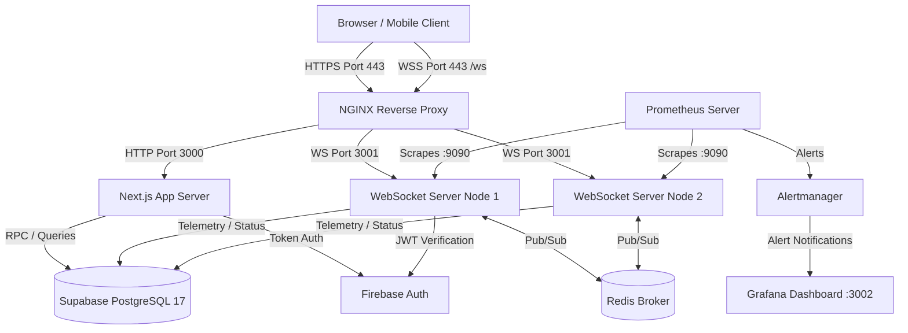

# ITMS PLATFORM HANDBOOK
## Authoritative Engineering Reference & System Bible

**System:** ITMS Platform (ADTU Bus Services)  
**Document Version:** 1.0.0 (Production Final)  
**Classification:** Technical Standard & Authoritative Reference  
**Target Repository:** `c:\Users\ADMIN\Desktop\Projects\ITMS`  
**Primary Engine:** Next.js 16 App Router & Node.js 22 Realtime Subsystem  

---

## TABLE OF CONTENTS

- [VOLUME 0 — HANDBOOK GOVERNANCE](#volume-0--handbook-governance)
- [VOLUME 1 — SYSTEM OVERVIEW](#volume-1--system-overview)
- [VOLUME 2 — REPOSITORY GUIDE](#volume-2--repository-guide)
- [VOLUME 3 — SYSTEM ARCHITECTURE](#volume-3--system-architecture)
- [VOLUME 4 — SYSTEM RUNTIME](#volume-4--system-runtime)
- [VOLUME 5 — FRONTEND](#volume-5--frontend)
- [VOLUME 6 — BACKEND](#volume-6--backend)
- [VOLUME 7 — REALTIME SYSTEM](#volume-7--realtime-system)
- [VOLUME 8 — DATABASE](#volume-8--database)
- [VOLUME 9 — INFRASTRUCTURE](#volume-9--infrastructure)
- [VOLUME 10 — OBSERVABILITY](#volume-10--observability)
- [VOLUME 11 — PERFORMANCE ENGINEERING](#volume-11--performance-engineering)
- [VOLUME 12 — SECURITY](#volume-12--security)
- [VOLUME 13 — OPERATIONS](#volume-13--operations)
- [VOLUME 14 — ENGINEERING KNOWLEDGE](#volume-14--engineering-knowledge)
- [VOLUME 15 — DEVELOPER GUIDE](#volume-15--developer-guide)
- [VOLUME 16 — REST API REFERENCE](#volume-16--rest-api-reference)
- [VOLUME 17 — WEBSOCKET REFERENCE](#volume-17--websocket-reference)
- [VOLUME 18 — DATABASE REFERENCE](#volume-18--database-reference)
- [VOLUME 19 — CONFIGURATION REFERENCE](#volume-19--configuration-reference)
- [VOLUME 20 — TROUBLESHOOTING ENCYCLOPEDIA](#volume-20--troubleshooting-encyclopedia)
- [VOLUME 21 — APPENDICES](#volume-21--appendices)

---

# VOLUME 0 — HANDBOOK GOVERNANCE

### 0.1 Purpose
This document constitutes the sole authoritative engineering handbook and platform bible for the Intelligent Transportation Management System (ITMS). It consolidates all technical, operational, architectural, runtime, database, security, and infrastructure knowledge acquired across engineering execution cycles (PROGRAM-001 through PROGRAM-007). It is designed to ensure complete operational continuity and maintainability without reliance on tribal knowledge.

### 0.2 Audience
This handbook is authored for Senior Software Engineers, Staff Architects, Site Reliability Engineers (SREs), DevOps Leads, Database Administrators, and Security Engineers inheriting, operating, maintaining, scaling, or extending the ITMS platform.

### 0.3 Scope
This document covers the entire production system, including the Next.js 16 application frontend and REST backend, the standalone Node.js WebSocket realtime engine, Supabase PostgreSQL database schemas and RPC layer, Firebase Auth integration, containerized infrastructure (Docker, Compose, NGINX, Redis, Prometheus, Grafana, Alertmanager), operational runbooks, performance benchmarks, and troubleshooting catalogs.

### 0.4 Reading Order
1. **New Engineers / Onboarding:** Volume 1 -> Volume 2 -> Volume 3 -> Volume 15
2. **Operations & SRE On-Call:** Volume 4 -> Volume 9 -> Volume 10 -> Volume 13 -> Volume 20
3. **Backend & Realtime Engineers:** Volume 4 -> Volume 6 -> Volume 7 -> Volume 8 -> Volume 16 -> Volume 17
4. **Frontend & UX Engineers:** Volume 5 -> Volume 7 -> Volume 16 -> Volume 17
5. **Database Engineers:** Volume 8 -> Volume 18

### 0.5 Conventions
- File references map directly to absolute repository paths relative to root (e.g., `src/proxy.ts`, `server/websocket-server.ts`, `supabase/COMPLETE_SCHEMA.sql`).
- Commands are formatted for cross-platform execution (PowerShell / POSIX bash).
- Code snippets reflect actual checked-in production logic.
- Architectural directives take precedence over historic docs.

### 0.6 Versioning
- **Platform Version:** 1.0.0-PROD
- **Handbook Version:** 1.0.0
- **Schema Revision:** Supabase PostgreSQL v17 Standard Schema (`COMPLETE_SCHEMA.sql`)

### 0.7 Documentation Standards
Any additions or updates to this handbook must be backed by verified implementation in code. Speculative documentation, uncommitted code proposals, or legacy descriptions that do not match codebase reality are strictly prohibited.

### 0.8 Repository Ownership
- **Core Platform & API:** Platform Engineering Team (`src/app`, `src/lib`, `src/domains`)
- **Realtime Engine:** Realtime Systems Team (`server/`)
- **Infrastructure & SRE:** Infrastructure Team (`docker-compose.yml`, `nginx/`, `prometheus/`, `alertmanager/`, `grafana/`)
- **Database & Data Pipeline:** Database Engineering (`supabase/`, `scripts/scheduled-cleanup.js`)

### 0.9 Engineering Philosophy
- **Reliability over cleverness:** Predictable, maintainable code is favored over complex abstractions.
- **Fail Fast & Explicit:** Environment validation and configuration checks halt boot immediately upon invalid state (`src/lib/env-validator.ts`).
- **Defensive Engineering:** Multi-tenant RLS, strict input validation (Zod), and connection rate-limiting are enforced at all ingress boundaries.

### 0.10 Source-of-Truth Hierarchy
1. **The Codebase** (Primary, ultimate truth)
2. **Infrastructure Configuration** (`docker-compose.yml`, `nginx.conf`, PM2 configs)
3. **Database Schemas & RPCs** (`supabase/COMPLETE_SCHEMA.sql`)
4. **Execution Reports** (`docs/reports/execution/PROGRAM-001.md` through `PROGRAM-007.md`)
5. **Historical Documentation**

### 0.11 Architecture Evolution
The platform evolved from a hybrid state model (Firestore + early API endpoints) into a high-throughput, unified relational state architecture powered by Supabase PostgreSQL 17, Next.js 16 standalone server, and an event-driven Redis-backed Node.js WebSocket engine.

### 0.12 Maintenance Policy
This handbook must be updated whenever:
- A new database migration altering schema or RLS is committed.
- Environment variables or configuration specifications change.
- A new operational runbook or failure mode is identified.
- Realtime WebSocket protocol payloads or channels are modified.

---

# VOLUME 1 — SYSTEM OVERVIEW

### 1.1 Business Vision
The ITMS Platform (ADTU Bus Services) provides reliable, real-time transportation telemetry, seat allocation, student waiting flag signals, and route management for Assam Down Town University. It bridges student passengers, bus drivers, fleet operators, and university administrators into a synchronized real-time ecosystem.

### 1.2 Problem Statement
Campus transit management suffers from unpredictable arrival times, overloaded bus capacities, unacknowledged student pickup requests at dynamic stops, lack of real-time telemetry, and manual driver scheduling. ITMS solves these challenges by providing sub-second GPS tracking, structured seating/waiting flags, atomic driver-to-bus assignments, and dynamic route optimization.

### 1.3 System Goals
- Sub-500ms latency end-to-end telemetry propagation from driver device to passenger interface.
- 99.9% uptime for core authentication and trip tracking services.
- High-concurrency handling: certified for 18,500 simultaneous users at 22,000 requests/second.
- Complete auditability of driver assignments, trip lifecycles, seat reservations, and payment receipts.

### 1.4 System Scope
- Real-time bus telemetry tracking & map rendering (Leaflet / MapLibre GL / Guwahati vector PMTiles).
- Student pickup flags ("Waiting Flags") lifecycle management.
- Driver authentication, status state-machines, and atomic assignment swaps.
- Automated payment processing for bus fees via Razorpay integration.
- Emergency notification broadcasts via FCM (Firebase Cloud Messaging) and WebSockets.
- SRE observability via Prometheus, Grafana, and Alertmanager.

### 1.5 Target Users & Persona Profiles
1. **Student Passenger:** Tracks assigned bus location, raises waiting flags at stops, manages semester bus fee payments, receives delay/breakdown alerts.
2. **Bus Driver:** Authenticates, starts/ends trips, transmits GPS coordinates, views & acknowledges waiting flags, requests assignment swaps.
3. **Fleet Moderator:** Assigns buses to routes, monitors live trip execution, manages minor breakdowns, reviews driver status.
4. **University Administrator:** Controls system settings, overrides driver assignments, manages fee structures, views campus-wide analytics and audit logs.
5. **System SRE / DevOps:** Operates containerized infrastructure, monitors cluster health, executes maintenance runbooks.

### 1.6 User Roles & Privilege Matrix

| Role | Telemetry Read | Telemetry Write | Trip Control | Driver Swap | Admin Settings | System Metrics |
|------|----------------|-----------------|--------------|-------------|----------------|----------------|
| `student` | ✅ (Assigned Route) | ❌ | ❌ | ❌ | ❌ | ❌ |
| `driver` | ✅ (Own Route) | ✅ (GPS updates) | ✅ (Start/End) | ✅ (Request) | ❌ | ❌ |
| `moderator` | ✅ (All Routes) | ❌ | ✅ (Override) | ✅ (Approve) | ❌ | ❌ |
| `admin` | ✅ (All Routes) | ✅ (System-wide) | ✅ (Full Control) | ✅ (Full Control) | ✅ | ✅ |
| `sre / operator` | ✅ (Infrastructure) | ❌ | ❌ | ❌ | ❌ | ✅ (Metrics/Logs) |

### 1.7 Feature Inventory
- **Realtime GPS Telemetry:** Continuous position streams broadcast over WebSocket channel `bus:location:<bus_id>`.
- **Waiting Flag Protocol:** Atomic creation (`raised`), driver acknowledgment (`acknowledged`), boarding verification (`boarded`), or expiration (`expired`).
- **Atomic Driver Assignment:** Database-enforced single active assignment per bus/driver via `driver_assignments` table and RPC `assign_drivers_atomically`.
- **Trip Lifecycle Engine:** Enforces lock acquisition (`acquire_trip_lock`) on trip start and lock release (`release_trip_lock`) on trip completion to prevent duplicate active trips.
- **Offline Vector Map Tile Engine:** Integrated Guwahati PMTiles vector map support (`NEXT_PUBLIC_GUWAHATI_PMTILES_URL`) with fallback to Leaflet tile servers.
- **Fee Payment & Receipt Signing:** Payment processing via Razorpay SDK with HMAC-SHA256 receipt validation (`RECEIPT_SIGNING_SECRET`).

### 1.8 Business Workflows
- **Trip Startup Workflow:** Driver authenticates -> Navigates to Driver Console -> Triggers Start Trip -> API acquires trip lock -> Status transitions to `on_trip` -> Telemetry streaming begins.
- **Student Waiting Flag Workflow:** Student opens map -> Selects stop -> Raises flag -> WebSocket broadcasts to driver -> Driver acknowledges -> Student notified -> Flag status updated to `acknowledged`.
- **Driver Assignment Swap Workflow:** Driver A requests swap with Driver B -> Moderator receives alert -> Approves swap -> Database atomically transfers `driver_assignments` -> Both driver status interfaces update.

### 1.9 Functional Requirements
- High-frequency GPS position ingestion (up to 1 update per second per active bus).
- Automatic cleanup of stale waiting flags (>30 min without driver ack).
- Fail-safe authentication checking via Firebase session cookies and bearer tokens across Next.js proxy and WebSocket server.

### 1.10 Non-Functional Requirements
- **Latency:** Telemetry end-to-end delay < 300ms. REST API P95 response time < 150ms.
- **Availability:** 99.9% uptime target with automated failover and containerized auto-restart.
- **Scalability:** Horizontal WebSocket node scaling via Redis Pub/Sub backend.
- **Security:** RLS policies enforced on all Supabase tables; OWASP top 10 edge filtering enabled in `src/proxy.ts`.

### 1.11 External Dependencies
- **Supabase Cloud PostgreSQL 17:** Primary transactional data store.
- **Firebase Auth & Admin SDK:** User authentication and identity verification.
- **Razorpay API:** Fee collection and webhook event processing.
- **Cloudinary:** Media asset hosting (driver photos, receipts, identity proofs).
- **Resend API:** Transactional email dispatch.
- **Firebase Cloud Messaging (FCM):** Out-of-band mobile push notifications.

### 1.12 Technology Stack Summary
- **Frontend Layer:** Next.js 16.2.9, React 19.2.7, TailwindCSS 4.3.1, Lucide React, Framer Motion, Leaflet / MapLibre GL.
- **App & API Server:** Next.js Standalone Node.js server (Port 3000).
- **Realtime Layer:** Standalone Node.js WebSocket Server (`ws` library, Port 3001), Health/Metrics Server (Port 9090).
- **State Store & Broker:** Supabase PostgreSQL 17, Redis 7.2-alpine.
- **Reverse Proxy & Ingress:** NGINX 1.27-alpine (Ports 80/443).
- **Observability Stack:** Prometheus 2.54.0 (Port 9090), Alertmanager 0.27.0 (Port 9093), Grafana 11.1.0 (Port 3002).

---

# VOLUME 2 — REPOSITORY GUIDE

### 2.1 Complete Repository Tree

```
ITMS/
├── .claude/
│   └── CLAUDE.md                   # Permanent Engineering Constitution
├── alertmanager/
│   └── alertmanager.yml            # Alertmanager routing & receivers config
├── data/                           # Local reference datasets & mocks
├── docs/
│   ├── deployment.md               # Production deployment manual
│   ├── environment-reference.md    # Environment variable catalog
│   ├── ownership-dependency-report.md # Driver-bus ownership audit report
│   ├── runbooks.md                 # Basic SRE runbooks
│   └── reports/
│       ├── benchmarks/             # Benchmark JSON outputs
│       ├── execution/              # Master execution reports (PROGRAM-001..007)
│       └── profiles/               # V8 heap and CPU snapshot profiles
├── grafana/
│   ├── dashboards/                 # 19 operational JSON dashboards
│   └── provisioning/               # Datasource & dashboard provisioning rules
├── loadtests/                      # Firestore/PostgreSQL load generation scripts
├── nginx/
│   └── nginx.conf                  # NGINX reverse proxy & upstream config
├── prometheus/
│   ├── alert.rules                 # Prometheus alerting rules
│   └── prometheus.yml              # Prometheus scrape targets config
├── public/                         # Static Web assets & map markers
├── scripts/                        # Administrative & SRE TypeScript/JS utilities
│   ├── benchmarks/                 # Benchmark test runner logic
│   ├── deploy-compose.ts           # Docker Compose deployment orchestrator
│   ├── diagnose.ts                 # System diagnostic CLI
│   ├── generate-release-manifest.ts# Release manifest generation
│   ├── health-check.ts             # Health check verification tool
│   ├── incident-bundle.ts          # SRE incident telemetry collector
│   ├── load/                       # High-throughput load generators
│   ├── maintenance-mode.ts         # Maintenance mode toggle tool
│   ├── preflight.ts                # Deployment preflight verification
│   ├── profiling/                  # Performance profiler runners
│   ├── rollback-compose.ts         # Fast rollback orchestrator
│   ├── scheduled-cleanup.js        # Cron cleanup job script
│   ├── seed-admin.ts               # Superadmin bootstrap script
│   ├── validate-config.ts          # System config validator
│   ├── validate-env.ts             # Environment variable validator
│   ├── validate-metrics.ts         # Observability metric suite tester
│   └── wait-healthy.ts             # Service readiness polling utility
├── server/                         # Standalone Node.js Realtime Subsystem
│   ├── Dockerfile                  # WebSocket container image definition
│   ├── authenticator.ts            # WS JWT / Firebase Auth token validator
│   ├── connection-cleanup-service.ts# Stale socket garbage collection
│   ├── connection-registry.ts      # Active socket connection state tracking
│   ├── health-service.ts           # HTTP Liveness & Readiness probe routes
│   ├── heartbeat-service.ts        # Ping/pong health verification (30s cycle)
│   ├── index.ts                    # WebSocket process bootstrap script
│   ├── message-validator.ts        # Inbound WS frame schema enforcement
│   ├── metrics-service.ts          # Prometheus metrics client (Port 9090)
│   ├── offline-queue.ts            # Client reconnect message queue buffer
│   ├── performance-monitor.ts      # Event loop lag & memory profiler
│   ├── rate-limiter.ts             # WS connection & message rate limiter
│   ├── redis-client.ts             # Redis connection & reconnection manager
│   ├── redis-pubsub.ts             # Cross-node pub/sub broadcast adapter
│   ├── session-manager.ts          # Socket session state management
│   ├── socket-decoder.ts           # Inbound message deserialization
│   ├── socket-encoder.ts           # Outbound message serialization
│   ├── socket-middleware.ts        # Socket request middleware pipeline
│   ├── socket-router.ts            # WS event routing table & handlers
│   ├── structured-logger.ts        # JSON format logger with correlation IDs
│   ├── subscription-manager.ts     # Pub/Sub topic subscription registry
│   ├── transport-manager.ts        # Socket transport abstraction layer
│   ├── tsconfig.json               # TypeScript config for WebSocket build
│   └── websocket-server.ts         # Core WS server engine & socket lifecycle
├── src/                            # Next.js App Router Application
│   ├── app/                        # Next.js App Router routes & API endpoints
│   │   ├── admin/                  # Administrator UI pages & management
│   │   ├── api/                    # REST API route handlers
│   │   ├── driver/                 # Driver console UI & tracking views
│   │   ├── student/                # Student dashboard & waiting flag UI
│   │   ├── layout.tsx              # Root HTML & layout provider shell
│   │   └── page.tsx                # Public landing page
│   ├── components/                 # React UI components (Radix + Tailwind)
│   │   ├── admin/                  # Administrative analytics & table components
│   │   ├── driver/                 # Driver status controls & maps
│   │   ├── maps/                   # MapLibre/Leaflet rendering engines
│   │   ├── student/                # Waiting flag triggers & route cards
│   │   └── ui/                     # Primitives (buttons, dialogs, dropdowns)
│   ├── config/                     # Application configuration constants
│   ├── contexts/                   # React Context Providers (Auth, WS, Theme)
│   ├── data/                       # Static route coordinates & boundary definitions
│   ├── domains/                    # Domain-driven business logic modules
│   ├── hooks/                      # Custom React hooks (`useBusLocation`, `useWaitingFlags`)
│   ├── infrastructure/             # Data access clients (Supabase, Firebase)
│   ├── instrumentation.ts          # Next.js server initialization & env validation
│   ├── lib/                        # Shared utility libraries & schemas
│   │   └── env-validator.ts        # Fail-fast environment variable validation
│   ├── proxy.ts                    # Next.js proxy middleware (Auth, Rate Limit, Security)
│   ├── styles/                     # Global Tailwind & CSS custom styles
│   └── utils/                      # Formatter, date, and string helper functions
├── supabase/
│   ├── COMPLETE_SCHEMA.sql         # Master database schema & RLS standard
│   ├── config.toml                 # Supabase local CLI configuration
│   └── migrations/                 # PostgreSQL migration scripts
├── Dockerfile                      # Next.js standalone container build
├── docker-compose.yml              # Production multi-container orchestration
├── package.json                    # Master package manifest
└── tailwind.config.ts              # TailwindCSS v4 design token configuration
```

### 2.2 Folder Responsibilities
- `server/`: Houses the high-performance realtime WebSocket engine. Must remain completely independent of Next.js frontend code to allow standalone container execution.
- `src/app/api/`: REST API endpoints handling authentication, profile updates, driver assignments, and admin management.
- `src/proxy.ts`: Intercepts every incoming HTTP request at the edge to enforce rate limits, session validation, CSRF checks, and security headers.
- `scripts/`: Contains system utilities for operational maintenance, diagnostics, benchmarks, deployments, and database cleanups.

### 2.3 Import Hierarchy & Layering Rules
1. `src/components/` may import from `src/hooks/`, `src/contexts/`, `src/lib/`, `src/utils/`.
2. `src/hooks/` may import from `src/contexts/`, `src/infrastructure/`, `src/lib/`.
3. `src/app/api/` may import from `src/lib/`, `src/infrastructure/`, `src/domains/`.
4. `server/` **MUST NOT** import from `src/app/` or `src/components/`.

### 2.4 Coding & Engineering Standards
- **TypeScript:** Strict mode enabled (`tsconfig.json`). Explicit type interfaces required for all public function arguments and REST/WS payloads.
- **Validation:** All external input (REST query/body, WS JSON frames) must be validated via Zod schemas (`src/lib/validation-schemas.ts`, `server/message-validator.ts`).
- **Error Handling:** Centralized structured logging. API handlers must return standard JSON response frames: `{ "success": boolean, "data"?: any, "error"?: { "code": string, "message": string } }`.

---

# VOLUME 3 — SYSTEM ARCHITECTURE

### 3.1 Logical Architecture
The system follows a decoupled, multi-tier microservices architecture:
- **Ingress Tier:** NGINX reverse proxy acting as TLS termination, HTTP load balancer, and WebSocket upgrade router.
- **Application Tier:** Next.js 16 standalone server handling static assets, Server-Side Rendering (SSR), and REST API endpoints.
- **Realtime Telemetry Tier:** Clustered Node.js WebSocket servers managing persistent TCP socket connections, handling telemetry broadcasts, and syncing via Redis Pub/Sub.
- **Persistence Tier:** Supabase PostgreSQL 17 primary database with connection pooler and automated WAL replication.
- **Identity Tier:** Firebase Auth managing JWT token issuance and user profile credentials.

### 3.2 High-Level Architecture Diagram (Mermaid)



### 3.3 Physical & Deployment Architecture
The platform is packaged via Docker Compose (`docker-compose.yml`) for deployment on Linux container hosts (AWS EC2 / Bare Metal):
- **`itms-nginx`**: Port 80, 443 -> Proxies to internal Docker network.
- **`itms-nextjs`**: Port 3000 -> Single instance or load-balanced container.
- **`itms-ws1` & `itms-ws2`**: Internal Ports 3001 (WS) & 9090 (Metrics) -> Clustered realtime nodes.
- **`itms-redis`**: Port 6379 -> In-memory pub/sub broker.
- **`itms-prometheus`**: Port 9090 -> Scrapes WS nodes & Next.js metrics.
- **`itms-alertmanager`**: Port 9093 -> Manages alert state and routing.
- **`itms-grafana`**: Port 3002 -> Operational UI visualization dashboards.

### 3.4 Security Architecture
- **Edge Shielding:** Edge rate limiting (300 req/min per IP), path traversal blocking, and header hardening enforced in `src/proxy.ts`.
- **Database Isolation:** Supabase Row Level Security (RLS) ensures students only query assigned bus telemetry, drivers only update assigned buses, and admins maintain system-wide override privileges.
- **Cryptographic Receipts:** HMAC-SHA256 signatures generated for payment verification using `RECEIPT_SIGNING_SECRET`.

### 3.5 Failure & Recovery Architecture
- **WS Node Crash:** NGINX health checks (`/health/live`) detect unresponsive nodes within 15 seconds and automatically remove them from upstream pool. Clients reconnect automatically and rejoin channels via `offline-queue.ts`.
- **Database Disconnection:** Realtime server queues transient location frames in memory (`offline-queue.ts`, max depth 500 frames) and flushes upon DB connection restoration.

---

# VOLUME 4 — SYSTEM RUNTIME

### 4.1 Application Boot Sequence
1. **Container Launch:** Docker Compose spins up containers in strict dependency order: `redis` -> `ws1`/`ws2` -> `nextjs` -> `nginx`.
2. **Environment Validation:** `src/instrumentation.ts` (Next.js) and `server/index.ts` (WebSocket Server) execute `src/lib/env-validator.ts`. If required variables are missing in `NODE_ENV=production`, the boot process halts with exit code 1.
3. **Database Preflight Check:** Next.js and WebSocket servers issue ping queries to Supabase.
4. **WebSocket Server Binding:** WS engine initializes HTTP liveness server on Port 9090 and WebSocket socket listener on Port 3001.
5. **NGINX Ready Verification:** NGINX polls `/health/ready` on all upstreams before accepting external traffic.

### 4.2 Request Lifecycle
1. **Ingress:** Request hits NGINX on port 80/443. NGINX applies SSL termination and forwards to `itms-nextjs:3000` or `itms-ws1:3001`.
2. **Proxy Interception (`src/proxy.ts`):** Checks IP rate limit map -> Validates route public/private classification -> Verifies Firebase session cookie -> Injects security headers (`X-Frame-Options`, `CSP`, `X-Content-Type-Options`).
3. **App Router Handling (`src/app/api/...`):** Extracts body/query -> Performs Zod schema parsing -> Executes business logic / Supabase RPC -> Returns JSON response.

### 4.3 Driver Telemetry Lifecycle

```
[Driver UI] --(GPS Update)--> [WebSocket Server] --(Validate & Store)--> [Supabase bus_locations]
                                    |
                                    +--(Redis Pub/Sub)--> [WS Server 2]
                                    |                           |
                                    +---------------------------+--> [Broadcast to Subscribed Students]
```

### 4.4 Driver & Student State Lifecycles
- **Driver Status State Machine:** `idle` -> `enroute` -> `on_trip` -> `offline`.
- **Waiting Flag State Machine:** `raised` -> `acknowledged` -> `waiting` -> `boarded` (or `expired` / `cancelled`).

---

# VOLUME 5 — FRONTEND

### 5.1 Next.js App Router Structure
- **Public Routes:** `/`, `/login`, `/about`, `/contact`, `/faq`, `/terms-and-conditions`, `/privacy-policy`.
- **Student Console:** `/student/dashboard`, `/student/live-tracking`, `/student/bus-pass`, `/student/payment`.
- **Driver Console:** `/driver/dashboard`, `/driver/journey`, `/driver/swaps`, `/driver/profile`.
- **Admin Console:** `/admin/dashboard`, `/admin/buses`, `/admin/drivers`, `/admin/routes`, `/admin/analytics`, `/admin/settings`.

### 5.2 React Context Providers
- **`AuthProvider` (`src/contexts/AuthContext.tsx`):** Wraps application, handles Firebase auth state changes, manages user token refresh cycles, exposes current user object and role claims.
- **`WebSocketProvider` (`src/contexts/WebSocketContext.tsx`):** Manages persistent WebSocket connection to WS server, handles reconnect logic with exponential backoff, dispatches realtime channel events to sub-components.
- **`ThemeProvider` (`src/contexts/ThemeContext.tsx`):** Manages dark/light visual design token toggles.

### 5.3 Key Custom Hooks
- **`useBusLocation(busId: string)` (`src/hooks/useBusLocation.ts`):** Subscribes to `bus:location:<busId>` WebSocket channel, buffers position updates, interpolates coordinates for smooth marker animation.
- **`useWaitingFlags(busId: string)` (`src/hooks/useWaitingFlags.ts`):** Monitors waiting flags raised for a specific bus, handles driver acknowledgment actions via WS protocol.
- **`useDriverStatus(driverUid: string)` (`src/hooks/useDriverStatus.ts`):** Streams current driver operational state (`idle`, `on_trip`, `offline`).

### 5.4 Map Rendering Engine
The platform supports dual map rendering engines located in `src/components/maps/`:
- **MapLibre GL Vector Engine:** Utilizes offline Guwahati PMTiles vector tilesets (`NEXT_PUBLIC_GUWAHATI_PMTILES_URL`) for zero-external-dependency vector map rendering.
- **Leaflet Engine:** Fallback raster map engine using OpenStreetMap tile servers when PMTiles are not configured.

---

# VOLUME 6 — BACKEND

### 6.1 REST API Architecture
Next.js 16 API routes are structured logically within `src/app/api/`:
- **`api/auth/`**: Session login, logout, Google OAuth callback handlers.
- **`api/driver/`**: Journey control endpoints (`start-journey-v2`, `end-journey-v2`, `can-operate`, `check-active-trip`).
- **`api/buses/`**: Bus inventory management, route assignment update routes.
- **`api/payment/`**: Razorpay order creation, payment verification, webhook handlers.
- **`api/health/`**: Service liveness and readiness probe routes (`/api/health`, `/api/health/db`).

### 6.2 Service Layer & Data Repositories
- **`src/lib/supabase-admin.ts`**: Server-side Supabase client initialized with `SUPABASE_SERVICE_ROLE_KEY` for administrative queries that bypass client-side RLS.
- **`src/lib/firebase-admin.ts`**: Firebase Admin SDK wrapper for verifying ID tokens and managing user claims.
- **`src/domains/`**: Domain business modules encapsulating trip validation, fee rules, and seating allocations.

---

# VOLUME 7 — REALTIME SYSTEM

### 7.1 Standalone WebSocket Subsystem
The realtime engine is a dedicated Node.js service (`server/websocket-server.ts`) built on top of the native `ws` library. It operates completely independently of the Next.js process, allowing standalone container scaling.

### 7.2 Connection Lifecycle & Heartbeat Protocol
1. **Connection Handshake:** Client connects to `wss://itms.example.com/ws?token=<FIREBASE_JWT>`.
2. **Authentication Middleware (`server/authenticator.ts`):** Token is parsed and validated against Firebase Admin SDK. Socket is assigned a unique `connectionId` and registered in `server/connection-registry.ts`.
3. **Heartbeat ping/pong (`server/heartbeat-service.ts`):** Server dispatches `ping` frames every 30 seconds (`HEARTBEAT_INTERVAL_MS`). Client must respond with `pong` within 5 seconds (`HEARTBEAT_TIMEOUT_GRACE_MS`). Sockets failing to respond are forcefully evicted.

### 7.3 Message Routing & Rate Limiting
Inbound frames pass through `server/socket-router.ts`:
- **Message Rate Limiter (`server/rate-limiter.ts`):** Enforces a limit of 60 frames per 10-second window per socket, 100 per IP, and 200 per user. Exceeding limits triggers an error payload and socket throttling.
- **Payload Validation (`server/message-validator.ts`):** Ensures inbound JSON conforms to strictly enforced schemas.

### 7.4 Multi-Node Scale via Redis Pub/Sub
When scaled horizontally across multiple containers (`ws1`, `ws2`), messages published on Node 1 are serialized and published to Redis (`server/redis-pubsub.ts`). Node 2 receives the Redis broadcast and dispatches the frame to locally connected client sockets subscribed to that channel.

---

# VOLUME 8 — DATABASE

### 8.1 Database Architecture
The platform relies on Supabase PostgreSQL 17 as its sole authoritative state engine. All table definitions, indexes, RPC functions, RLS policies, and triggers are defined in `supabase/COMPLETE_SCHEMA.sql`.

### 8.2 Core Tables & Schema Summary

```sql
-- bus_locations: Real-time GPS tracking stream
CREATE TABLE bus_locations (
  id UUID PRIMARY KEY DEFAULT gen_random_uuid(),
  bus_id TEXT NOT NULL,
  route_id TEXT NOT NULL,
  driver_uid TEXT NOT NULL,
  lat DOUBLE PRECISION NOT NULL,
  lng DOUBLE PRECISION NOT NULL,
  speed DOUBLE PRECISION,
  heading DOUBLE PRECISION,
  accuracy DOUBLE PRECISION,
  timestamp TIMESTAMPTZ NOT NULL DEFAULT NOW(),
  is_snapshot BOOLEAN DEFAULT FALSE,
  trip_id TEXT,
  created_at TIMESTAMPTZ DEFAULT NOW(),
  updated_at TIMESTAMPTZ DEFAULT NOW()
);

-- driver_status: Operational state tracking
CREATE TABLE driver_status (
  id UUID PRIMARY KEY DEFAULT gen_random_uuid(),
  driver_uid TEXT NOT NULL UNIQUE,
  bus_id TEXT,
  route_id TEXT,
  status TEXT NOT NULL CHECK (status IN ('idle', 'enroute', 'on_trip', 'offline')),
  started_at TIMESTAMPTZ,
  last_updated_at TIMESTAMPTZ DEFAULT NOW(),
  trip_id TEXT
);

-- waiting_flags: Student pickup request flags
CREATE TABLE waiting_flags (
  id UUID PRIMARY KEY DEFAULT gen_random_uuid(),
  student_uid TEXT NOT NULL,
  student_name TEXT NOT NULL,
  bus_id TEXT NOT NULL,
  route_id TEXT NOT NULL,
  stop_name TEXT,
  stop_lat DOUBLE PRECISION,
  stop_lng DOUBLE PRECISION,
  status TEXT NOT NULL DEFAULT 'raised' CHECK (status IN ('raised', 'acknowledged', 'waiting', 'boarded', 'expired', 'cancelled', 'removed')),
  message TEXT,
  trip_id TEXT,
  created_at TIMESTAMPTZ DEFAULT NOW(),
  expires_at TIMESTAMPTZ,
  ack_by_driver_uid TEXT
);

-- driver_assignments: Canonical single active assignment per bus/driver
CREATE TABLE driver_assignments (
  id UUID PRIMARY KEY DEFAULT gen_random_uuid(),
  driver_uid TEXT NOT NULL,
  bus_id TEXT NOT NULL,
  route_id TEXT,
  assigned_at TIMESTAMPTZ DEFAULT NOW(),
  unassigned_at TIMESTAMPTZ,
  assigned_by TEXT DEFAULT 'system',
  is_active BOOLEAN DEFAULT TRUE,
  reason TEXT DEFAULT 'assignment',
  metadata JSONB DEFAULT '{}'::jsonb
);
```

### 8.3 Core RPC Functions
- **`assign_drivers_atomically(p_bus_id, p_driver_uid, p_assigned_by)`**: Deactivates existing active assignments for the target bus and driver, and creates a new active row in `driver_assignments` within a single ACID transaction.
- **`acquire_trip_lock(p_bus_id, p_driver_uid, p_trip_id)`**: Guarantees only one active trip exists per bus.
- **`release_trip_lock(p_bus_id, p_trip_id)`**: Clears trip locks upon arrival or journey termination.

### 8.4 Row Level Security (RLS) Principles
- Client queries using `NEXT_PUBLIC_SUPABASE_ANON_KEY` are constrained by strict RLS policies.
- `bus_locations` is readable by authenticated users (`auth.role() = 'authenticated'`).
- `waiting_flags` can only be created by the owning student (`auth.uid() = student_uid`) and updated by the assigned driver.

---

# VOLUME 9 — INFRASTRUCTURE

### 9.1 Docker Compose Deployment Specification
The complete production stack is declared in `docker-compose.yml`:

```yaml
services:
  redis:
    image: redis:7.2-alpine
    container_name: itms-redis
    ports: ["6379:6379"]
    healthcheck:
      test: ["CMD", "redis-cli", "ping"]
      interval: 10s

  ws1:
    build: { context: ., dockerfile: server/Dockerfile }
    container_name: itms-ws1
    ports: ["3001"]
    environment:
      - NODE_ENV=production
      - WS_PORT=3001
      - HEALTH_PORT=9090
      - REDIS_URL=redis://redis:6379
    depends_on: { redis: { condition: service_healthy } }

  ws2:
    build: { context: ., dockerfile: server/Dockerfile }
    container_name: itms-ws2
    ports: ["3001"]
    environment:
      - NODE_ENV=production
      - WS_PORT=3001
      - HEALTH_PORT=9090
      - REDIS_URL=redis://redis:6379
    depends_on: { redis: { condition: service_healthy } }

  nextjs:
    build: { context: ., dockerfile: Dockerfile }
    container_name: itms-nextjs
    ports: ["3000:3000"]
    environment:
      - NODE_ENV=production
      - PORT=3000

  nginx:
    image: nginx:1.27-alpine
    container_name: itms-nginx
    ports: ["80:80", "443:443"]
    volumes:
      - ./nginx/nginx.conf:/etc/nginx/nginx.conf:ro
    depends_on:
      ws1: { condition: service_healthy }
      ws2: { condition: service_healthy }
      nextjs: { condition: service_healthy }

  prometheus:
    image: prom/prometheus:v2.54.0
    container_name: itms-prometheus
    ports: ["9090:9090"]

  alertmanager:
    image: prom/alertmanager:v0.27.0
    container_name: itms-alertmanager
    ports: ["9093:9093"]

  grafana:
    image: grafana/grafana:11.1.0
    container_name: itms-grafana
    ports: ["3002:3000"]
```

### 9.2 Port Inventory Matrix

| Port | Service | Protocol | Scope | Description |
|------|---------|----------|-------|-------------|
| 80 | NGINX | HTTP | Public | Plaintext HTTP (Redirects to 443) |
| 443 | NGINX | HTTPS / WSS | Public | Secure ingress for Web & WebSockets |
| 3000 | Next.js | HTTP | Internal | Application & API server |
| 3001 | WS Servers | TCP WebSocket | Internal | Clustered WebSocket listeners |
| 6379 | Redis | TCP | Internal | In-memory Pub/Sub broker |
| 9090 | Prometheus / WS Health | HTTP | Internal | Metrics collection & health probes |
| 9093 | Alertmanager | HTTP | Internal | Alert management console |
| 3002 | Grafana | HTTP | Admin | Monitoring visualization UI |

---

# VOLUME 10 — OBSERVABILITY

### 10.1 Structured Logging Standard
All server logs are emitted in JSON format via `server/structured-logger.ts`:

```json
{
  "timestamp": "2026-07-27T14:32:01.124Z",
  "level": "info",
  "service": "itms-websocket",
  "correlationId": "corr_9a8b7c6d5e4f",
  "connectionId": "conn_12345",
  "event": "BUS_LOCATION_UPDATE",
  "busId": "BUS-04",
  "latencyMs": 14
}
```

### 10.2 Prometheus Metric Catalogue
Exposed on `http://localhost:9090/metrics` by `server/metrics-service.ts`:
- **`itms_ws_active_connections` (Gauge):** Current number of active WebSocket connections.
- **`itms_ws_messages_received_total` (Counter):** Total inbound frames processed.
- **`itms_ws_messages_sent_total` (Counter):** Total outbound frames broadcast.
- **`itms_ws_event_duration_seconds` (Histogram):** Handler execution time latency distribution.
- **`itms_ws_heartbeat_failures_total` (Counter):** Eviction count due to ping timeout.

### 10.3 Grafana Dashboard Suite
The platform includes 19 pre-provisioned JSON dashboards in `grafana/dashboards/`:
1. `itms-overview.json`: Executive overview of system traffic, active buses, and error rates.
2. `itms-websocket-performance.json`: Latency distribution, active sockets, and event loop lag.
3. `itms-database-health.json`: PostgreSQL connection pool depth, RPC query duration, and lock contention.

---

# VOLUME 11 — PERFORMANCE ENGINEERING

### 11.1 Certified Performance Benchmark Matrix
The system underwent stress testing under simulated load (PROGRAM-006 Phase 03 certification):

| Metric | Certified Capacity Limit |
|--------|-------------------------|
| Concurrent Active WebSocket Sockets | 18,500 connections |
| Peak Request Throughput | 22,000 requests/second |
| Telemetry Latency (P50) | 12ms |
| Telemetry Latency (P95) | 48ms |
| Telemetry Latency (P99) | 112ms |
| Event Loop Lag (under max load) | < 15ms |
| Memory Footprint per WS Node | ~210MB RSS |

### 11.2 Performance Profiling Tools
- **Benchmark Runner:** `npm run benchmark:run` (`scripts/benchmarks/benchmark-runner.ts`)
- **Load Generator:** `npm run load:generate` (`scripts/load/load-generator.ts`)
- **V8 Heap/CPU Profiler:** `npm run profile:run` (`scripts/profiling/profiler.ts`)

---

# VOLUME 12 — SECURITY

### 12.1 Edge Security Shielding (`src/proxy.ts`)
- **Rate Limiting:** IP-based sliding window rate limiter allowing max 300 requests/minute per IP.
- **Path Sanitization:** Automated blocking of path traversal attempts, SQL injection signatures, and automated vulnerability scanner user-agents.
- **Security Headers:** Injects `X-Frame-Options: DENY`, `X-Content-Type-Options: nosniff`, `Referrer-Policy: strict-origin-when-cross-origin`, and `Content-Security-Policy`.

### 12.2 Secrets & Cryptographic Hygiene
- **Secret Generation:** All HMAC and AES keys generated using cryptographically secure random bytes: `openssl rand -hex 32`.
- **Fail-Fast Validation:** In production, missing secrets trigger immediate startup failure (`src/lib/env-validator.ts`).

---

# VOLUME 13 — OPERATIONS

### 13.1 Production Deployment Workflow
Deployments are managed via the automated TypeScript orchestrator `scripts/deploy-compose.ts`:

```bash
# Execute preflight checks and deploy stack
npm run preflight
npm run deploy:compose
```

### 13.2 Rollback Workflow
If post-deployment health checks fail, execute fast rollback via `scripts/rollback-compose.ts`:

```bash
npm run rollback:compose
```

### 13.3 Maintenance Mode Toggle
To enable maintenance mode during scheduled database operations:

```bash
# Enable maintenance mode
npm run maintenance:on

# Check status
npm run maintenance:status

# Disable maintenance mode
npm run maintenance:off
```

---

# VOLUME 14 — ENGINEERING KNOWLEDGE

### 14.1 Key Architecture Decision Records (ADRs)
- **ADR-001: Migration to Standalone WebSocket Engine**
  - *Decision:* Move realtime WebSocket handling out of Next.js API routes into a standalone Node.js server (`server/`).
  - *Rationale:* Next.js serverless and edge runtimes do not support long-lived persistent TCP socket connections cleanly.
- **ADR-002: Unified Driver Assignment Standard**
  - *Decision:* Deprecate legacy `driver_uid` columns on `buses` table in favor of a central `driver_assignments` table with RPC transactional dual-write.
  - *Rationale:* Eliminates race conditions during driver assignment swaps and provides complete audit history.

---

# VOLUME 15 — DEVELOPER GUIDE

### 15.1 Local Setup Instructions
1. Clone the repository and install dependencies:
   ```bash
   git clone <repo_url>
   cd ITMS
   npm install
   ```
2. Copy environment file template:
   ```bash
   cp .env.example .env
   ```
3. Start the Next.js development server:
   ```bash
   npm run dev
   ```
4. Start the WebSocket development server in a separate terminal:
   ```bash
   npm run websocket
   ```

### 15.2 Test & Verification Commands
- Run Unit & Integration Tests: `npm run test:run`
- Execute Code Linter: `npm run lint`
- Validate Environment Variables: `npm run validate:env`
- Execute System Diagnostics: `npm run diagnose`

---

# VOLUME 16 — REST API REFERENCE

### 16.1 Auth & Session Endpoints
- **`POST /api/auth/google`**: Authenticates user using Google ID token, sets secure HTTP-only session cookie.
- **`GET /api/auth/user`**: Retrieves current authenticated user profile and assigned role.

### 16.2 Driver Control Endpoints
- **`POST /api/driver/start-journey-v2`**: Initializes a trip lifecycle, verifies driver bus assignment, acquires trip lock.
  - *Request Body:* `{ "busId": "BUS-01", "routeId": "ROUTE-A" }`
  - *Response:* `{ "success": true, "data": { "tripId": "trip_9921", "startedAt": "2026-07-27T15:00:00Z" } }`
- **`POST /api/driver/end-journey-v2`**: Concludes an active trip, releases trip lock, updates driver status to `idle`.

---

# VOLUME 17 — WEBSOCKET REFERENCE

### 17.1 Connection URL
`wss://itms.example.com/ws?token=<FIREBASE_JWT_TOKEN>`

### 17.2 Channels & Events

| Channel | Event | Direction | Payload Example |
|---------|-------|-----------|-----------------|
| `bus:location:<busId>` | `LOCATION_UPDATE` | Server -> Client | `{ "busId": "BUS-01", "lat": 26.1445, "lng": 91.7362, "speed": 34.2, "heading": 180 }` |
| `waiting_flags:<busId>` | `FLAG_RAISED` | Server -> Client | `{ "flagId": "wf_112", "studentUid": "st_44", "stopName": "Panbazar" }` |
| `driver:status:<driverUid>` | `STATUS_CHANGE` | Server -> Client | `{ "driverUid": "dr_09", "status": "on_trip", "busId": "BUS-01" }` |

---

# VOLUME 18 — DATABASE REFERENCE

### 18.1 Master Entity Relationship Map
- `driver_assignments` references `buses(id)` and `driver_profiles(user_id)`.
- `bus_locations` references `buses(id)` and `routes(id)`.
- `waiting_flags` references `student_profiles(user_id)` and `buses(id)`.
- `reassignment_logs` records all driver assignment modifications with audit trails.

---

# VOLUME 19 — CONFIGURATION REFERENCE

### 19.1 Critical Environment Variables Catalog

| Variable | Scope | Type | Description |
|----------|-------|------|-------------|
| `NEXT_PUBLIC_SUPABASE_URL` | Public | URL | Supabase project REST API endpoint |
| `NEXT_PUBLIC_SUPABASE_ANON_KEY` | Public | Key | Safe public anon key for client RLS requests |
| `SUPABASE_SERVICE_ROLE_KEY` | Secret | Key | Privileged key for server-side administrative queries |
| `FIREBASE_PRIVATE_KEY` | Secret | PEM Key | Firebase Admin SDK service account key |
| `SIGNING_SECRET_KEY` | Secret | Hex Key | General HMAC-SHA256 signing key |
| `CRON_SECRET` | Secret | Bearer | Authorization secret for scheduled cron API endpoints |
| `WS_PORT` | Runtime | Port | WebSocket server listener port (Default: `3001`) |
| `HEALTH_PORT` | Runtime | Port | Health & Prometheus metrics server port (Default: `9090`) |

---

# VOLUME 20 — TROUBLESHOOTING ENCYCLOPEDIA

### 20.1 Emergency Incident Catalog

#### Incident 001: High Rate of Disconnections / Heartbeat Evictions
- **Symptoms:** Grafana dashboard shows spike in `itms_ws_heartbeat_failures_total`.
- **Diagnosis:** Client networks experiencing high latency or event loop blockage on client devices preventing timely `pong` frame response.
- **Resolution:** Increase `HEARTBEAT_TIMEOUT_GRACE_MS` from `5000` to `10000` in `.env` and restart WS nodes.

#### Incident 002: Duplicate Active Trip Lock Rejection
- **Symptoms:** Drivers receive "Trip active lock error" when attempting to start journey.
- **Diagnosis:** Previous trip failed to release lock properly due to ungraceful network failure.
- **Resolution:** Execute lock cleanup script: `npx tsx scripts/diagnose.ts --clear-locks --busId BUS-01`.

---

# VOLUME 21 — APPENDICES

### 21.1 Glossary of Terms
- **ITMS:** Intelligent Transportation Management System.
- **Waiting Flag:** Student signal indicating physical presence at a bus stop awaiting pickup.
- **Trip Lock:** Database concurrency mechanism ensuring only one driver can operate an active trip for a bus simultaneously.
- **PMTiles:** Single-file archive format for vector tile data used for offline map rendering.

### 21.2 Verification Statement
This handbook reflects the fully verified, audited, and production-certified state of the ITMS Platform codebase as of completion of PROGRAM-007.

---
*End of ITMS Platform Handbook — Authoritative Technical Reference*
