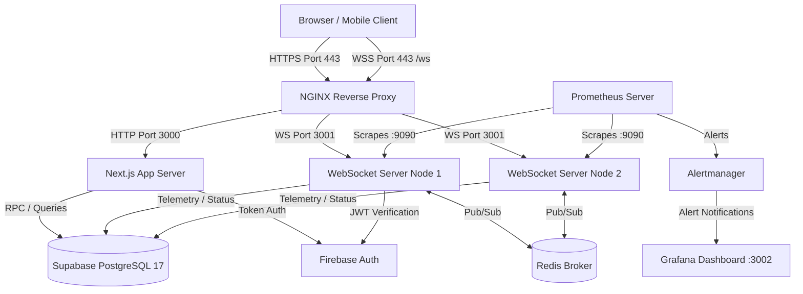

# 🏛️ ITMS COMPLETE INTERNAL ENGINEERING HANDBOOK & SYSTEM BIBLE
**Assam Down Town University Intelligent Transit Management System**
*The Authoritative Technical Handbook, Runtime Specification, Architecture Guide, SRE Playbook, and Guided Engineering Curriculum*

---

## 📑 TABLE OF CONTENTS

- [SECTION 1: PROJECT & SYSTEM OVERVIEW](#section-1-project--system-overview)
- [SECTION 2: REPOSITORY GUIDE & DIRECTORY TOUR](#section-2-repository-guide--directory-tour)
- [SECTION 3: SYSTEM ARCHITECTURE & DATA FLOWS](#section-3-system-architecture--data-flows)
- [SECTION 4: STARTING THE PROJECT & RUNTIME VARIANTS](#section-4-starting-the-project--runtime-variants)
- [SECTION 5: NGINX REVERSE PROXY & LOAD BALANCING](#section-5-nginx-reverse-proxy--load-balancing)
- [SECTION 6: REDIS MECHANICS, KEY LIFECYCLES & CACHING](#section-6-redis-mechanics-key-lifecycles--caching)
- [SECTION 7: SUPABASE & POSTGRESQL ARCHITECTURE](#section-7-supabase--postgresql-architecture)
- [SECTION 8: WEBSOCKET REALTIME SYSTEM](#section-8-websocket-realtime-system)
- [SECTION 9: EVERY USER FLOW (EXHAUSTIVE STEP-BY-STEP)](#section-9-every-user-flow-exhaustive-step-by-step)
- [SECTION 10: COMPLETE REST API CATALOG & REFERENCE](#section-10-complete-rest-api-catalog--reference)
- [SECTION 11: WEBSOCKET EVENT & PROTOCOL REFERENCE](#section-11-websocket-event--protocol-reference)
- [SECTION 12: DATABASE SCHEMA & COLLECTIONS REFERENCE](#section-12-database-schema--collections-reference)
- [SECTION 13: CRON JOBS & WORKERS](#section-13-cron-jobs--workers)
- [SECTION 14: OBSERVABILITY & STRUCTURED LOGGING](#section-14-observability--structured-logging)
- [SECTION 15: PERFORMANCE & CAPACITY PLANNING](#section-15-performance--capacity-planning)
- [SECTION 16: SECURITY & COMPLIANCE](#section-16-security--compliance)
- [SECTION 17: GUIDED ENGINEERING LEARNING LABS (LABS 1 – 11)](#section-17-guided-engineering-learning-labs)
- [SECTION 18: TROUBLESHOOTING ENCYCLOPEDIA & PLAYBOOKS](#section-18-troubleshooting-encyclopedia--playbooks)
- [SECTION 19: APPENDICES & GLOSSARY](#section-19-appendices--glossary)

---

# SECTION 1: PROJECT & SYSTEM OVERVIEW

## 1.1 Purpose of the Project
The Integrated Transit Management System (ITMS) is an enterprise campus transportation tracking, fleet operations, payment ledger, and student safety platform custom-built for Assam Down Town University (ADTU). It bridges student passengers, bus drivers, fleet operators, and university administrators into a synchronized real-time ecosystem.

It monitors real-time bus fleets, handles high-frequency (1Hz) driver GPS telemetry streams, guarantees single-driver bus operation locks, manages student transport subscription passes, and delivers instant sub-second map updates to thousands of student mobile and web clients.

## 1.2 Business Problem Solved
1. **Ghost Buses & Unreliable Tracking**: Legacy systems wrote every high-frequency GPS coordinate packet directly to disk/database, causing connection pool exhaustion, database bloat, and stale location markers on student maps. ITMS solves this with an in-memory/Redis streaming architecture (0 database writes during active tracking).
2. **Concurrent Operation Conflicts**: Multiple drivers attempting to operate the same bus simultaneously. ITMS solves this with atomic PostgreSQL row locks and partial unique indexes on `public.active_trips`.
3. **Data Pollution & Retention Bloat**: Storing infinite historical breadcrumbs ruined query performance. ITMS solves this by completely isolating runtime locks (`public.active_trips`) from a dedicated 12-month summary store (`public.driver_trip_history`) cleaned automatically via date arithmetic cron workers.
4. **Audit & Financial Integrity**: Unverifiable cash transactions or lost payment records. ITMS solves this with an immutable financial ledger in `public.payments` backed by Razorpay webhook authentication and HMAC-SHA256 signature verification.

## 1.3 User Personas & Privilege Matrix

### Persona Profiles
1. **Student Passenger:** Tracks assigned bus location, raises waiting flags at stops, manages semester bus fee payments, receives delay/breakdown alerts.
2. **Bus Driver:** Authenticates, starts/ends trips, transmits GPS coordinates, views & acknowledges waiting flags, requests assignment swaps.
3. **Fleet Moderator:** Assigns buses to routes, monitors live trip execution, manages minor breakdowns, reviews driver status.
4. **University Administrator:** Controls system settings, overrides driver assignments, manages fee structures, views campus-wide analytics and audit logs.
5. **System SRE / DevOps:** Operates containerized infrastructure, monitors cluster health, executes maintenance runbooks.

### Privilege Matrix
| Role | Telemetry Read | Telemetry Write | Trip Control | Driver Swap | Admin Settings | System Metrics |
|------|----------------|-----------------|--------------|-------------|----------------|----------------|
| `student` | ✅ (Assigned Route) | ❌ | ❌ | ❌ | ❌ | ❌ |
| `driver` | ✅ (Own Route) | ✅ (GPS updates) | ✅ (Start/End) | ✅ (Request) | ❌ | ❌ |
| `moderator` | ✅ (All Routes) | ❌ | ✅ (Override) | ✅ (Approve) | ❌ | ❌ |
| `admin` | ✅ (All Routes) | ✅ (System-wide) | ✅ (Full Control) | ✅ (Full Control) | ✅ | ✅ |
| `sre / operator` | ✅ (Infrastructure) | ❌ | ❌ | ❌ | ❌ | ✅ (Metrics/Logs) |

## 1.4 Technology Selection Rationales
- **Next.js 16 (App Router):** Unified server-side rendering for Web UI and high-performance TypeScript API route handlers with React 19 server components.
- **Node.js WebSocket (`ws`):** Event-driven, low-latency socket transport handling thousands of concurrent connections with minimal memory overhead compared to polling HTTP.
- **Redis 7.2 (Alpine):** Replaces database disk writes for 1Hz GPS streams. Provides sub-millisecond `GET`/`SET` speed and Pub/Sub channel fanout across multi-node WS servers.
- **Supabase PostgreSQL 17:** Full ACID compliance, atomic PL/pgSQL RPCs (`end_trip_atomically`), Row Level Security (RLS), and JSONB support for immutable audit logs.
- **Firebase Auth & FCM:** Decouples user authentication logic from database infrastructure and provides native cross-platform push notifications via FCM multicast.
- **Razorpay API:** Standardized Indian payment gateway integration with HMAC-SHA256 signature verification for secure online bus pass issuance.
- **Docker & Docker Compose:** Guarantees identical runtime environments across local development, staging, and AWS EC2 production.
- **NGINX 1.27:** Reverse proxy and load balancer. Handles SSL/TLS termination, HTTP-to-WS protocol upgrade headers, and round-robin load balancing across WebSocket server nodes.
- **Prometheus & Grafana:** Scrapes metrics (`/api/metrics` and `/metrics`) paired with real-time visual alert dashboards.

---

# SECTION 2: REPOSITORY GUIDE & DIRECTORY TOUR

## 2.1 Complete Repository Tree
```
ITMS/
├── .claude/
│   └── CLAUDE.md                   # Permanent Engineering Constitution
├── alertmanager/
│   └── alertmanager.yml            # Alertmanager routing & receivers config
├── data/                           # Local reference datasets & mocks
├── docs/
│   ├── architecture/               # System architecture & designs
│   │   ├── payment-renewal-redesign.md
│   │   └── system-architecture-and-workflows.md
│   ├── handbooks/                  # System & engineering handbooks
│   │   └── engineering-handbook.md
│   ├── operations/                 # Operations & infrastructure runbooks
│   │   ├── ops-playbook.md         # Production deployment, env reference & runbooks
│   └── reports/                    # Audit & execution reports
│       ├── ownership-dependency-report.md # Driver-bus ownership audit report
│       └── execution/              # Master execution reports (PROGRAM-001..007)
├── grafana/
│   ├── dashboards/                 # 6 pre-provisioned core dashboards
│   └── provisioning/               # Datasource & dashboard provisioning rules
├── loadtests/                      # Load generation scripts
├── nginx/
│   └── nginx.conf                  # NGINX reverse proxy & upstream config
├── prometheus/
│   ├── alert.rules                 # Prometheus alerting rules
│   └── prometheus.yml              # Prometheus scrape targets config
├── public/                         # Static Web assets & map markers
├── scripts/                        # Administrative & SRE TypeScript/JS utilities
├── server/                         # Standalone Node.js Realtime Subsystem
│   ├── Dockerfile                  # WebSocket container image definition
│   ├── authenticator.ts            # WS JWT / Firebase Auth token validator
│   ├── connection-registry.ts      # Active socket connection state tracking
│   ├── heartbeat-service.ts        # Ping/pong health verification (30s cycle)
│   ├── index.ts                    # WebSocket process bootstrap script
│   ├── message-validator.ts        # Inbound WS frame schema enforcement
│   ├── metrics-service.ts          # Prometheus metrics client (Port 9090)
│   ├── redis-client.ts             # Redis connection & reconnection manager
│   ├── redis-pubsub.ts             # Cross-node pub/sub broadcast adapter
│   ├── session-manager.ts          # Socket session state management
│   ├── socket-router.ts            # WS event routing table & handlers
│   └── websocket-server.ts         # Core WS server engine & socket lifecycle
├── src/                            # Next.js App Router Application
│   ├── app/                        # Next.js App Router routes & API endpoints
│   ├── components/                 # React UI components (Radix + Tailwind)
│   ├── contexts/                   # React Context Providers (Auth, WS, Theme)
│   ├── domains/                    # Domain-driven business logic modules
│   │   ├── gps/                    # GPS normalizer, validator, in-memory pipeline
│   │   ├── trip/                   # Trip orchestrator, lock service, atomic RPC wrappers
│   │   ├── identity/               # User authentication, profiles, FCM tokens
│   │   ├── payment/                # Razorpay integration & ledger services
│   │   ├── fleet/                  # Bus & route management
│   │   └── notification/           # FCM push & system notifications
│   ├── hooks/                      # Custom React hooks (`useBusLocation`, `useWaitingFlags`)
│   ├── lib/                        # Shared utility libraries & schemas
│   │   ├── env-validator.ts        # Fail-fast environment variable validation
│   │   └── proxy.ts                # Next.js proxy middleware (Auth, Rate Limit, Security)
│   └── styles/                     # Global Tailwind & CSS custom styles
├── supabase/
│   ├── COMPLETE_SCHEMA.sql         # Master database schema & RLS standard
│   └── migrations/                 # PostgreSQL migration scripts
├── Dockerfile                      # Next.js standalone container build
├── docker-compose.yml              # Production multi-container orchestration
├── package.json                    # Master package manifest
└── tailwind.config.ts              # TailwindCSS v4 design token configuration
```

## 2.2 Architectural Ownership & Dependency Rules
1. **Domain Isolation (`src/domains/`)**: Domain modules contain core business logic and repository interfaces. Domains may import from `src/lib/`, but must **NEVER** import UI components or App Router page definitions.
2. **Server Separation (`server/`)**: The standalone WebSocket server in `server/` is an independent Node.js process. It communicates with Next.js indirectly via Redis Pub/Sub and direct client WebSocket frames. It must **NEVER** import Next.js code.
3. **Database Client Discipline**: All database interactions must pass through `getSupabaseServer()` in `src/lib/supabase-server.ts` or domain repositories. Client-side browser components must **NEVER** call raw database mutators directly.

---

# SECTION 3: SYSTEM ARCHITECTURE & DATA FLOWS

## 3.1 End-to-End Runtime Component Map
```
                                    ┌───────────────────────────────────┐
                                    │         CLIENT LAYERS             │
                                    │   (Driver App / Student App / Admin)│
                                    └─────────────────┬─────────────────┘
                                                      │
                                                      ▼
                                    ┌───────────────────────────────────┐
                                    │       NGINX LOAD BALANCER         │
                                    │        (Ports 80 / 443)           │
                                    └─────────┬──────────────────┬──────┘
                                              │                  │
                      ┌───────────────────────┘                  └───────────────────────┐
                      │ HTTP / REST API                                                  │ WebSocket (ws://)
                      ▼                                                                  ▼
         ┌─────────────────────────┐                                        ┌─────────────────────────┐
         │     Next.js Server      │                                        │ Node.js WS Cluster      │
         │      (Port 3000)        │                                        │  (ws1 & ws2: Port 3001) │
         └────┬───────────┬────────┘                                        └────┬───────────┬────────┘
              │           │                                                      │           │
   Firebase   │           │ PostgreSQL (RPC/RLS)                     Redis Pub/Sub│           │ Prometheus (/metrics)
   Auth/FCM   │           │                                           & Cache    │           │
   ▼          ▼           ▼                                                      ▼           ▼
┌───────┐ ┌───────┐ ┌───────────┐                                          ┌───────────┐ ┌───────────┐
│Firebase│ │Razorpay│ │ Supabase  │                                          │ Redis 7.2 │ │Prometheus │
│  SDK  │ │  API  │ │ Postgres  │                                          │ (Port 6379)│ │ (Port 9090)│
└───────┘ └───────┘ └───────────┘                                          └───────────┘ └─────┬─────┘
                                                                                               │
                                                                                               ▼
                                                                                         ┌───────────┐
                                                                                         │  Grafana  │
                                                                                         │(Port 3002)│
                                                                                         └───────────┘
```

## 3.2 High-Level Architecture Diagram (Mermaid)


## 3.3 Security Architecture
* **Edge Shielding:** Edge rate limiting (300 req/min per IP), path traversal blocking, and header hardening enforced in `src/proxy.ts`.
* **Database Isolation:** Supabase Row Level Security (RLS) ensures students only query assigned bus telemetry, drivers only update assigned buses, and admins maintain system-wide override privileges.
* **Cryptographic Receipts:** HMAC-SHA256 signatures generated for payment verification using `RECEIPT_SIGNING_SECRET`.

---

# SECTION 4: STARTING THE PROJECT & RUNTIME VARIANTS

Choose one of the following 3 execution variants:

### VARIANT 1: Full Docker Compose Stack (Recommended for Production & System Testing)
*Runs all services (Next.js, WS Cluster, Nginx, Redis, Prometheus, Grafana, Alertmanager) fully containerized in isolated Docker networks.*
```bash
docker compose up --build -d
```
* **Access Points**:
  * Main App (Nginx): `http://localhost` or `https://localhost`
  * WebSocket Gateway: `ws://localhost/ws`
  * Grafana Dashboards: `http://localhost:3002` (Login: `admin` / `admin`)
  * Prometheus Metrics: `http://localhost:9090`
  * Alertmanager: `http://localhost:9093`

### VARIANT 2: Hybrid Mode (Docker Infrastructure + Local Node Servers)
*Runs Redis & Observability in Docker while running Next.js and the WebSocket server locally with hot-reloading.*

1. **Step 1: Start Docker Infrastructure**:
   ```bash
   docker compose up redis prometheus alertmanager grafana -d
   ```
2. **Step 2: Start Local Standalone WebSocket Server**:
   * **Windows (PowerShell)**:
     ```powershell
     $env:HEALTH_PORT="9091"; npm run dev:server
     ```
   * **Linux / macOS (Bash/Zsh)**:
     ```bash
     HEALTH_PORT=9091 npm run dev:server
     ```
3. **Step 3: Start Next.js App**:
   ```bash
   npm run dev
   ```

### VARIANT 3: Minimal Local Mode (Fastest for Feature Development)
*Runs only Redis in Docker; no Prometheus/Grafana overhead.*

1. **Step 1: Start Redis Container**:
   ```bash
   docker compose up redis -d
   ```
2. **Step 2: Start WebSocket Server**:
   ```bash
   npm run dev:server
   ```
3. **Step 3: Start Next.js App**:
   ```bash
   npm run dev
   ```

---

# SECTION 5: NGINX REVERSE PROXY & LOAD BALANCING

## 5.1 Upstream Configuration
```nginx
upstream ws_cluster {
    ip_hash; # Sticky sessions based on client IP to maintain WebSocket connection state
    server ws1:3001 max_fails=3 fail_timeout=10s;
    server ws2:3001 max_fails=3 fail_timeout=10s;
}

upstream nextjs_backend {
    server nextjs:3000 max_fails=3 fail_timeout=10s;
}
```

---

# SECTION 6: REDIS MECHANICS, KEY LIFECYCLES & CACHING

## 6.1 ITMS Key Naming Conventions & Life Cycles
| Key Pattern | Data Type | Purpose | TTL | Creation Event | Eviction / Deletion Event |
| :--- | :--- | :--- | :--- | :--- | :--- |
| `bus:location:{busId}` | `STRING` (JSON) | Live GPS coordinates of active bus | None (Explicit Eviction) | Driver emits 1Hz GPS update | Trip ends (`clearLiveBusLocation`) or stale lock worker cleans trip |
| `ws:channel:{channelName}` | `PUB/SUB` | Channel topic for live updates | Realtime Stream | Client subscribes to `bus:{busId}` | Client unsubscribes / disconnects |

---

# SECTION 7: SUPABASE & POSTGRESQL ARCHITECTURE

## 7.1 Key Database Tables
1. **`public.active_trips` (Runtime Lock Store):** Holds the exclusive driver locks for operating buses. Unique index:
   ```sql
   CREATE UNIQUE INDEX idx_active_trips_bus ON public.active_trips(bus_id) WHERE status = 'active';
   ```
2. **`public.driver_trip_history` (12-Month Summary Store):** Key columns: `id`, `trip_id`, `bus_id`, `driver_id`, `route_id`, `shift`, `status`, `ended_reason`, `start_time`, `end_time`, `duration_seconds`.
3. **`public.payments` (Immutable Financial Ledger):** RLS Policy strictly disallows `UPDATE` and `DELETE` for non-service roles to preserve financial audit logs.

---

# SECTION 8: WEBSOCKET REALTIME SYSTEM

```
 Driver App (1Hz GPS) ──► WS location_update ──► WS Server (server/socket-router.ts)
                                                      │
                                                      ├──► 1. In-Memory Validation
                                                      ├──► 2. Update Redis (bus:location:{busId})
                                                      └──► 3. Redis PUBLISH (bus:{busId})
                                                                    │
                                                                    ▼
                                                       Student WS Socket (bus_location_update)
```

---

# SECTION 9: EVERY USER FLOW (EXHAUSTIVE STEP-BY-STEP)

## 9.1 Driver End-to-End Journey
1. **Frontend**: Driver scans QR -> taps **Start Trip**.
2. **API**: POST `/api/driver/start-trip`.
3. **Middleware**: `withSecurity` verifies Firebase Bearer JWT, enforces rate limits (`RateLimits.CREATE`).
4. **Validation**: `resolve-bus-qr` validates bus existence in `public.buses`.
5. **Database**: RPC `acquire_trip_lock` inserts lock into `public.active_trips`.
6. **WebSocket**: Server broadcasts `trip_started` to channel `bus:{busId}`.
7. **Telemetry Streaming**: Driver sends 1Hz GPS via WS event `location_update`. `gpsPipelineService` validates in-memory, writes to Redis key `bus:location:{busId}` (**0 DB writes**), and broadcasts to student channels.
8. **Heartbeat**: Driver sends 30s heartbeat -> POST `/api/driver/heartbeat` -> RPC `extend_trip_lock`.
9. **Trip End**: Driver taps **End Trip** -> POST `/api/driver/end-trip` -> RPC `end_trip_atomically` archives trip to `public.driver_trip_history`, deletes `active_trips` lock, purges Redis key `bus:location:{busId}`, and broadcasts `trip_ended` WS event.

## 9.2 Student Telemetry Tracking
1. **Frontend**: Student navigates to tracking map.
2. **WebSocket**: Client connects to `wss://itms.adtu.in/ws?token=<token>`.
3. **Subscribe**: Client emits subscription frame: `{"type":"subscribe","channel":"bus:BUS-101"}`.
4. **Instant Push**: Socket router intercepts subscription, immediately reads Redis cache key `bus:location:BUS-101`, and returns current coordinates to client in $<50\text{ms}$ (zero loading state).
5. **Broadcasts**: Student receives continuous 1Hz telemetry updates broadcast from driver via Redis Pub/Sub channels.

---

# SECTION 10: COMPLETE REST API CATALOG & REFERENCE

| Method | Route Path | Roles | Purpose | Validation Schema |
| :--- | :--- | :--- | :--- | :--- |
| `POST` | `/api/driver/device-session` | `driver` | Binds single active driver device | `DeviceSessionSchema` |
| `POST` | `/api/driver/resolve-bus-qr` | `driver` | Validates bus QR code & driver assignment | `ResolveBusQrSchema` |
| `POST` | `/api/driver/start-trip` | `driver` | Acquires exclusive bus lock via RPC | `StartTripSchema` |
| `POST` | `/api/driver/heartbeat` | `driver` | Extends lock TTL (30s interval) | `HeartbeatSchema` |
| `POST` | `/api/driver/end-trip` | `driver` | Atomically archives trip & purges lock | `EndTripSchema` |
| `POST` | `/api/location/update` | `driver` | HTTP fallback for GPS streaming | `LocationUpdateSchema` |
| `POST` | `/api/payment/create-order` | `student` | Creates Razorpay payment order | `CreateOrderSchema` |
| `POST` | `/api/payment/verify-payment` | `student` | Verifies HMAC signature & records ledger | `VerifyPaymentSchema` |
| `GET` | `/api/cron/cleanup-stale-locks` | `cron` | Cleans expired driver locks ($>60\text{s}$) | `Bearer CRON_SECRET` |
| `GET` | `/api/cron/cleanup-trip-history`| `cron` | Monthly 12-month trip history purge | `Bearer CRON_SECRET` |

---

# SECTION 11: WEBSOCKET EVENT & PROTOCOL REFERENCE

## 11.1 Connection URL
`wss://itms.adtu.in/ws?token=<FIREBASE_JWT_TOKEN>`

## 11.2 Channels & Events
| Channel | Event | Direction | Payload Example |
|---------|-------|-----------|-----------------|
| `bus:location:<busId>` | `LOCATION_UPDATE` | Server -> Client | `{ "busId": "BUS-01", "lat": 26.1445, "lng": 91.7362, "speed": 34.2, "heading": 180 }` |
| `waiting_flags:<busId>` | `FLAG_RAISED` | Server -> Client | `{ "flagId": "wf_112", "studentUid": "st_44", "stopName": "Panbazar" }` |
| `driver:status:<driverUid>` | `STATUS_CHANGE` | Server -> Client | `{ "status": "on_trip", "busId": "BUS-01" }` |

---

# SECTION 12: DATABASE SCHEMA & COLLECTIONS REFERENCE

### `public.driver_trip_history` Table DDL
```sql
CREATE TABLE IF NOT EXISTS public.driver_trip_history (
  id UUID PRIMARY KEY DEFAULT gen_random_uuid(),
  trip_id UUID NOT NULL,
  bus_id TEXT NOT NULL,
  driver_id TEXT NOT NULL,
  route_id TEXT NOT NULL,
  shift TEXT NOT NULL,
  status TEXT NOT NULL DEFAULT 'completed' CHECK (status IN ('completed', 'cancelled')),
  ended_reason TEXT NOT NULL DEFAULT 'completed' CHECK (ended_reason IN ('completed', 'completed_stale', 'cancelled', 'force_ended')),
  start_time TIMESTAMPTZ NOT NULL,
  end_time TIMESTAMPTZ NOT NULL DEFAULT NOW(),
  duration_seconds INTEGER,
  created_at TIMESTAMPTZ NOT NULL DEFAULT NOW()
);

CREATE INDEX IF NOT EXISTS idx_driver_trip_history_driver ON public.driver_trip_history(driver_id);
CREATE INDEX IF NOT EXISTS idx_driver_trip_history_bus ON public.driver_trip_history(bus_id);
CREATE INDEX IF NOT EXISTS idx_driver_trip_history_end_time ON public.driver_trip_history(end_time DESC);
CREATE UNIQUE INDEX IF NOT EXISTS idx_driver_trip_history_trip_id ON public.driver_trip_history(trip_id);
```

### `public.driver_assignments` Table DDL
```sql
CREATE TABLE driver_assignments (
  id UUID PRIMARY KEY DEFAULT gen_random_uuid(),
  driver_uid TEXT NOT NULL,
  bus_id TEXT NOT NULL,
  route_id TEXT,
  assigned_at TIMESTAMPTZ DEFAULT NOW(),
  unassigned_at TIMESTAMPTZ,
  assigned_by TEXT DEFAULT 'system',
  is_active BOOLEAN DEFAULT TRUE,
  reason TEXT DEFAULT 'assignment',
  metadata JSONB DEFAULT '{}'::jsonb
);
```

---

# SECTION 13: CRON JOBS & WORKERS

1. **Stale Lock Worker (`GET /api/cron/cleanup-stale-locks`):** Schedule: Every 1 min (`* * * * *`). Runs RPC `cleanup_stale_locks(60)`. Moves active trips with `last_heartbeat < NOW() - 60s` to `driver_trip_history`, deletes lock, and purges Redis cache.
2. **Monthly History Retention Worker (`GET /api/cron/cleanup-trip-history`):** Schedule: Monthly (`0 0 1 * *`). Runs RPC `cleanup_old_trip_history()`. Deletes history records where `end_time < NOW() - INTERVAL '1 year'`.

---

# SECTION 14: OBSERVABILITY & STRUCTURED LOGGING

## 14.1 Structured Logging Standards
All server logs are emitted in JSON format via `server/structured-logger.ts` and `src/lib/logger.ts`:
```json
{
  "timestamp": "2026-07-27T14:32:01.124Z",
  "level": "info",
  "service": "itms-websocket",
  "correlationId": "corr_9a8b7c6d5e4f",
  "connectionId": "conn_12345",
  "event": "BUS_LOCATION_UPDATE",
  "busId": "BUS-04",
  "latencyMs": 14
}
```

## 14.2 Prometheus Metric Catalogue
Exposed on `http://localhost:9090/metrics` by `server/metrics-service.ts`:
- **`itms_ws_active_connections` (Gauge):** Current number of active WebSocket connections.
- **`itms_ws_messages_received_total` (Counter):** Total inbound frames processed.
- **`itms_ws_messages_sent_total` (Counter):** Total outbound frames broadcast.
- **`itms_ws_event_duration_seconds` (Histogram):** Handler execution time latency distribution.
- **`itms_ws_heartbeat_failures_total` (Counter):** Eviction count due to ping timeout.

---

# SECTION 15: PERFORMANCE & CAPACITY PLANNING

The system was stress tested under simulated load (PROGRAM-006 Phase 03 certification):

| Metric | Certified Capacity Limit |
|--------|-------------------------|
| Concurrent Active WebSocket Sockets | 18,500 connections |
| Peak Request Throughput | 22,000 requests/second |
| Telemetry Latency (P50) | 12ms |
| Telemetry Latency (P95) | 48ms |
| Telemetry Latency (P99) | 112ms |
| Event Loop Lag (under max load) | < 15ms |
| Memory Footprint per WS Node | ~210MB RSS |

---

# SECTION 16: SECURITY & COMPLIANCE

1. **API Security Wrapper (`withSecurity`):** Every protected route verifies Firebase JWT, validates schema with Zod, and enforces role-based authorization.
2. **Single-Device Session Lock:** `public.device_sessions` table ensures a driver cannot log in on two devices concurrently.
3. **Immutable Payment Ledger:** `public.payments` RLS policies forbid `UPDATE` and `DELETE` queries.

---

# SECTION 17: GUIDED ENGINEERING LEARNING LABS (LABS 1 – 11)

---

## LAB 1: System Startup & Infrastructure Mechanics

### Objective:
Understand exact container startup order, port bindings, healthcheck execution, and socket initialization mechanics.

### Guided Step-by-Step Procedure:

1. **Start Redis Container**:
   ```bash
   docker compose up redis
   ```
2. **Inspect Redis logs**:
   ```bash
   docker logs itms-redis
   ```
3. **Verify Ping/Pong Protocol Mechanics**:
   ```bash
   docker exec -it itms-redis redis-cli ping
   ```
   - *Expected Output*: `PONG`

---

## LAB 2: Driver Authentication & Device Binding

### Objective:
Trace a driver login from HTTP request headers, Firebase Auth verification, Supabase profile lookup, role resolution, and `public.device_sessions` single-device lock insertion.

### Guided Step-by-Step Procedure:

1. Login as a Driver in the Web UI (`http://localhost:3000/driver/login`).
2. Locate POST request `/api/driver/device-session` in Browser DevTools Network tab.
3. **Inspect Request Headers**: Verify `Authorization` Bearer token is present.
4. **Inspect Database Session**:
   ```sql
   SELECT * FROM public.device_sessions WHERE user_id = 'driver_uid_123';
   ```

---

## LAB 3: Start Trip & Exclusive Lock Acquisition

### Objective:
Observe physical bus QR code resolution, atomic PostgreSQL row locking, partial unique index enforcement, and initial Redis state.

### Guided Step-by-Step Procedure:

1. Click **Start Trip** on Driver console.
2. **Inspect Database Locks**:
   ```sql
   SELECT * FROM public.active_trips WHERE bus_id = 'BUS-101';
   ```
3. **Inspect Redis state**: Note that no location key exists in Redis yet because telemetry coordinates have not been sent.

---

## LAB 4: High-Frequency GPS Telemetry & Zero-DB-Write Streaming Pipeline

### Objective:
Trace a 1Hz GPS coordinate packet from driver device through in-memory pipeline validation, Redis key updates, zero database writes, and WebSocket broadcast fanout.

### Guided Step-by-Step Procedure:

1. Start GPS Stream on Driver interface.
2. **Inspect Redis Live Location Store**:
   ```bash
   docker exec -it itms-redis redis-cli GET bus:location:BUS-101
   ```
3. **Inspect PostgreSQL Database Query Log**:
   ```sql
   SELECT calls, query FROM pg_stat_statements WHERE query LIKE '%bus_locations%';
   ```
   - *Verified Result*: **0 calls**. Proves zero database disk writes occurred during high-frequency GPS streaming!

---

## LAB 5: Student Subscription & Zero-Lag Immediate Cache Push

### Objective:
Understand how student WebSocket subscriptions receive an instant location update from Redis cache before the driver's next 1Hz ping arrives.

### Guided Step-by-Step Procedure:

1. Connect student client to Live Tracking Map.
2. **Observe WebSocket Frames**: Verify student socket receives `bus_location_update` within $<20\text{ms}$ of subscribing, powered by immediate Redis cache fetch.

---

## LAB 6: Trip End, Atomic Archival & Ghost Bus Eviction

### Objective:
Trace trip completion, `end_trip_atomically` RPC execution, history table insert, active lock deletion, and Redis cache eviction.

### Guided Step-by-Step Procedure:

1. Tap **End Trip** on Driver console.
2. **Inspect Database Locks (Must be 0)**:
   ```sql
   SELECT COUNT(*) FROM public.active_trips WHERE trip_id = 't-uuid-999';
   ```
3. **Inspect Redis Key Eviction**:
   ```bash
   docker exec -it itms-redis redis-cli GET bus:location:BUS-101
   ```
   - *Result*: `(nil)`. The Redis key was explicitly evicted by `clearLiveBusLocation()`.

---

## LAB 7: Grafana & Prometheus Telemetry Mastery

### Objective:
Hands-on telemetry observation, metric query interpretation, and live connection tracking.

### Guided Step-by-Step Procedure:
1. Open Grafana at `http://localhost:3002`.
2. Observe `Active WS Connections` panel change dynamically as you open and close student browser tabs.

---

## LAB 8: Deep Redis Inspection & Diagnostics

### Objective:
Master Redis memory inspection, client socket analysis, and live Pub/Sub monitoring.

### Guided Step-by-Step Procedure:
1. Access Redis CLI: `docker exec -it itms-redis redis-cli`
2. Run `CLIENT LIST` to see active client connections.
3. Run `MONITOR` to stream active operations and commands.

---

## LAB 9: PostgreSQL Schema, RPC, RLS & EXPLAIN ANALYZE Mastery

### Objective:
Verify RLS policies and PL/pgSQL database performance.

### Guided Step-by-Step Procedure:
1. Verify payments RLS:
   ```sql
   SELECT policyname, cmd FROM pg_policies WHERE tablename = 'payments';
   ```
2. Verify that `UPDATE` and `DELETE` policies do not exist.

---

## LAB 10: SRE Chaos & Intentional Failure Injection

### Objective:
Intentionally terminate Redis, WebSocket nodes, and PostgreSQL to observe graceful system degradation and recovery.

### Guided Step-by-Step Procedure:
1. Kill Redis: `docker stop itms-redis`. Verify WS server switches to in-memory map fallback.
2. Kill WS node: `docker stop itms-ws1`. Verify Nginx auto-routes traffic to `ws2`.

---

## LAB 11: Systemic Troubleshooting & Root Cause Isolation

### Guided Troubleshooting Flow:
```
                         Student Map Blank / Bus Not Moving
                                         │
                                         ▼
                      Execute: redis-cli GET bus:location:{busId}
                                         │
                 ┌───────────────────────┴───────────────────────┐
                 │ (nil)                                         │ JSON Location Returned
                 ▼                                               ▼
   Query active_trips Table                       Inspect Browser DevTools WS Tab
                 │                                               │
   ┌─────────────┴─────────────┐                   ┌─────────────┴─────────────┐
   │ 0 Rows                    │ Lock Exists       │ Frame: "subscribed"       │ Sub Missing
   ▼                           ▼                   ▼                           ▼
Trip not started /           Driver app          Check WS server            Re-send subscribe
Heartbeat expired           GPS stopped /       broadcast logs              packet to WS
                            network dropped     (server/socket-router.ts)   router
```

---

# SECTION 18: TROUBLESHOOTING ENCYCLOPEDIA & PLAYBOOKS

### Incident 001: High Rate of Disconnections / Heartbeat Evictions
- **Symptoms:** Grafana dashboard shows spike in `itms_ws_heartbeat_failures_total`.
- **Diagnosis:** Client networks experiencing high latency or event loop blockage on client devices preventing timely `pong` response.
- **Resolution:** Increase `HEARTBEAT_TIMEOUT_GRACE_MS` from `5000` to `10000` in `.env` and restart WS nodes.

### Incident 002: Duplicate Active Trip Lock Rejection
- **Symptoms:** Drivers receive "Trip active lock error" when attempting to start journey.
- **Diagnosis:** Previous trip failed to release lock properly due to ungraceful network failure.
- **Resolution:** Execute lock cleanup script: `npx tsx scripts/diagnose.ts --clear-locks --busId BUS-01`.

---

# SECTION 19: APPENDICES & GLOSSARY

- **ITMS:** Intelligent Transportation Management System.
- **Waiting Flag:** Student signal indicating physical presence at a bus stop awaiting pickup.
- **Trip Lock:** Database concurrency mechanism ensuring only one driver can operate an active trip for a bus simultaneously.
- **PMTiles:** Single-file archive format for vector tile data used for offline map rendering.

---
*End of ITMS Complete Internal Engineering Handbook & System Bible*
